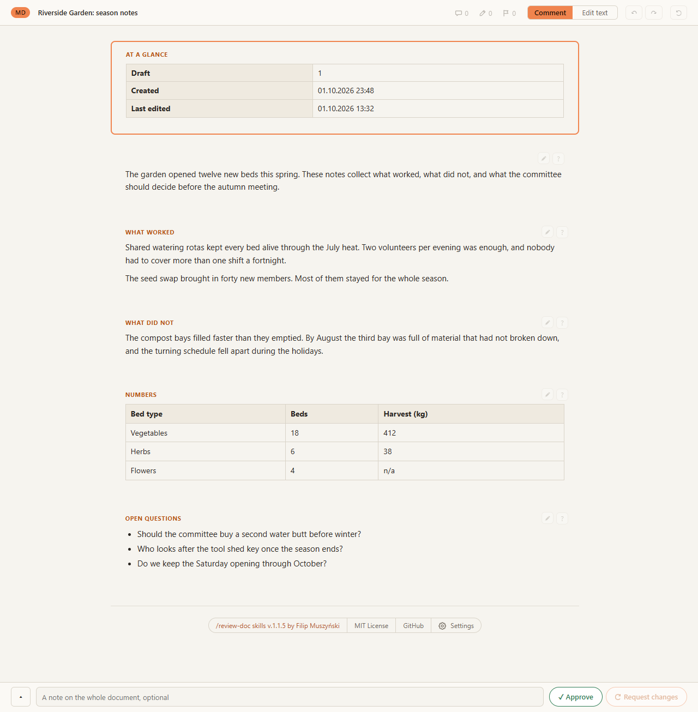
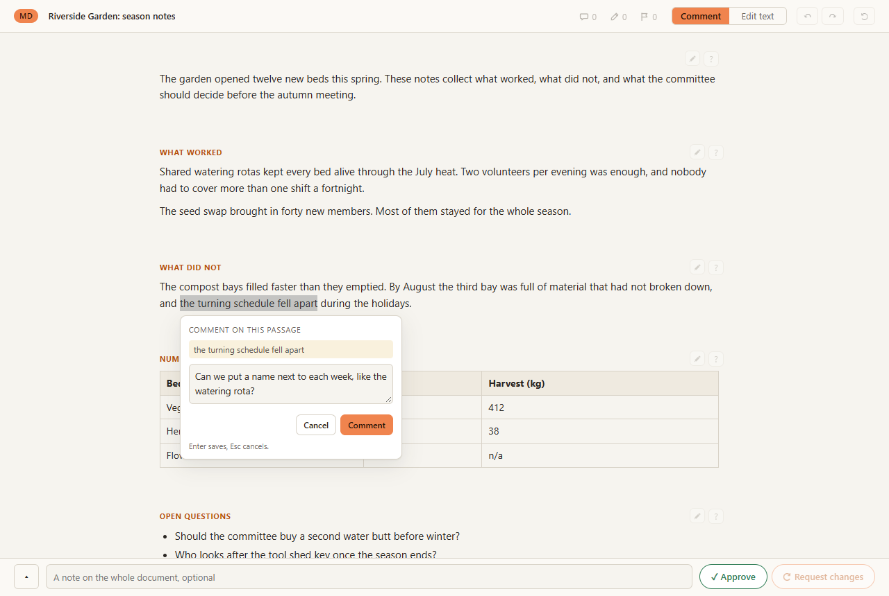
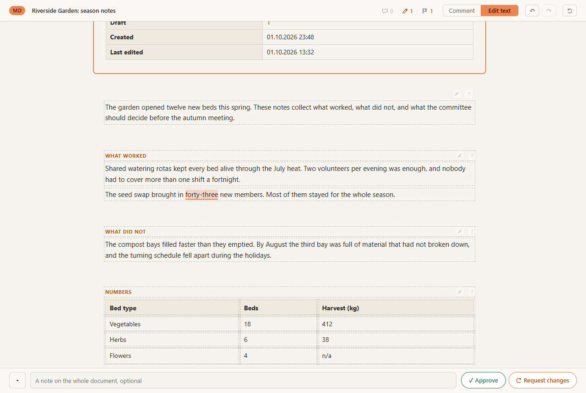
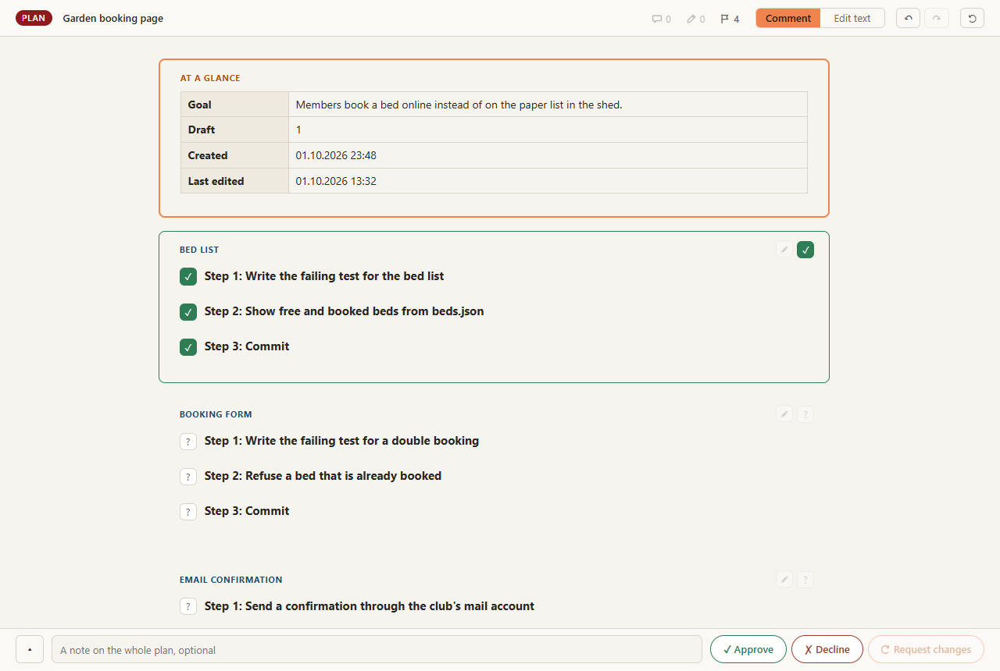
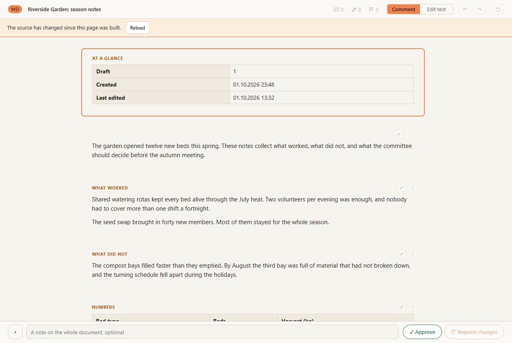
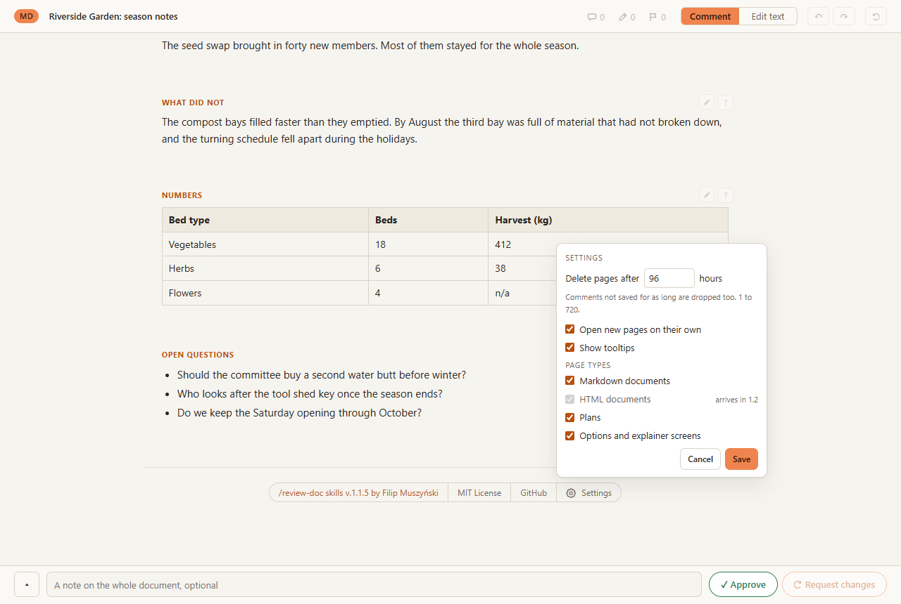
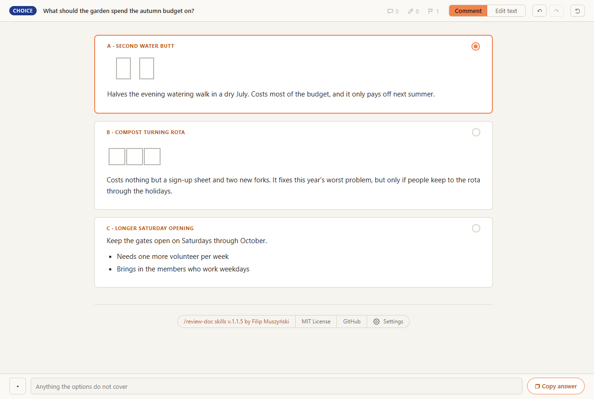

# review-doc

Review Markdown documents and Claude's plans in your browser instead of the terminal.
Comment on any passage, rewrite text in place, approve or decline sections, then paste
one block back to Claude.

This repository is a small library of Claude Code skills; `review-doc` is the first.



## What it does

When Claude writes a plan, or when you ask it to review a document, `review-doc` turns
the Markdown into a page on your own machine and hands you the link. On that page you
can:

- select any passage and leave a comment;

  

- switch to Edit text and rewrite text in place; the page shows what changed;

  

- approve or decline each section or step;
- finish with Approve, Decline or Request changes. That copies your whole answer, and
  you paste it into Claude.

Nothing leaves your computer. The pages are served from `127.0.0.1` and deleted after
96 hours (you can change that).

## Install

You need Claude Code and Python 3.10 or later on your PATH.

In Claude Code, type:

```
/plugin marketplace add filmuszynski/skills
/plugin install review-doc@filmuszynski-skills
```

Then type `/reload-plugins` (or restart Claude Code). A running session does not see a
newly installed plugin until you do.

**Optional, for VS Code users:** the first time a page is made inside a VS Code
terminal, Claude asks once whether pages should open in VS Code's built-in browser.
Say yes and it installs a small extension from this repository's release. Say no and
pages open in your normal browser.

## First use

Ask Claude to review a document:

```
/review-doc notes.md
```

or just say "let me review notes.md in the browser". If another skill is also called
`review-doc`, use the full name, `/review-doc:review-doc`. The page opens on its own and
Claude also gives you the link. Comment, rewrite, approve or decline, then press one of
the buttons at the bottom and paste what it copied into Claude.

## Plan review

You do not need to do anything. Whenever Claude writes a plan into a `.claude/plans/`
folder (in plan mode, for example), the page is made automatically and Claude gives
you the link. Decline a step to say "not this one"; Request changes sends Claude back
to revise the plan.



If the Markdown changes while its page is open, the page notices and offers to reload:



## Settings

Open ⚙ Settings at the bottom of any page:



or use the terminal command:

```
/review-doc:settings
/review-doc:settings set stale-hours 48
/review-doc:settings set auto-open off
/review-doc:settings reset
```

| Name | Values | Default | What it does |
|---|---|---|---|
| `stale-hours` | 1 to 720 | 96 | Pages older than this many hours are deleted, and unsaved comments older than this are dropped |
| `auto-open` | on, off | on | Opens each new page right after it is made |
| `tooltips` | on, off | on | Shows the small labels that explain each button on a review page |
| `md` | on, off | on | Markdown document pages |
| `html` | on, off | on | HTML document pages (arriving in v1.1) |
| `plan` | on, off | on | Plan pages, made automatically when Claude writes a plan |
| `choice` | on, off | on | Choice screens (see below) |

Settings live in `~/.review-doc/config.json`.

## Advanced: choice screens

When Claude needs you to pick between options that are easier to judge by looking,
ask it to show them as a choice screen. Each option becomes a card; pick one, add a
note, and paste the answer back.



## Troubleshooting

- **Every file edit shows a hook error.** Claude Code cannot find Python. Install
  Python 3.10 or later and make sure `python3` (macOS, Linux) or `python` (Windows)
  works in a new terminal. On Windows, turn off the Microsoft Store alias for
  `python3` under Settings, Apps, Advanced app settings, App execution aliases.
- **No page after installing.** Type `/reload-plugins` or restart Claude Code.
- **The link starts with `file://`.** All ports from 7777 to 7787 are taken, so no
  local server could start. The page still works; settings are then changed with
  `/review-doc:settings`. The draft number in At a glance needs the server, so such a page stays at Draft 1.
- **A page says it has expired.** Pages are kept for `stale-hours`. Ask Claude to
  review the file again to make a new one.
- **Pages open in VS Code although you use another editor.** Cursor and some other
  editors set `TERM_PROGRAM=vscode`. Turn `auto-open` off, or decline the extension.
- **Something else.** The server writes to `~/.review-doc/server.log`. Please attach
  its last lines to a bug report.

## Manual install

Clone the repository and add it as a local marketplace:

```
git clone https://github.com/filmuszynski/skills
```

then in Claude Code, with the path to the clone:

```
/plugin marketplace add ./skills
/plugin install review-doc@filmuszynski-skills
/reload-plugins
```

To install the VS Code extension by hand, download `review-doc-opener.vsix` from the
[latest release](https://github.com/filmuszynski/skills/releases/latest) and run
`code --install-extension review-doc-opener.vsix`.

## License and credit

MIT, see [LICENSE](LICENSE). Made by [Filip Muszynski](https://github.com/filmuszynski).
Python-Markdown is bundled under its own license in
`plugins/review-doc/presenter/vendor/markdown/LICENSE.md`.
